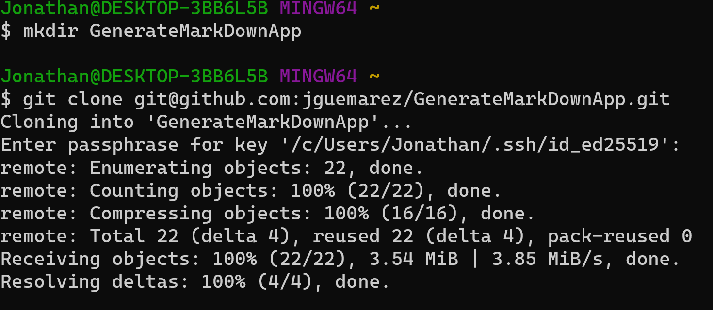
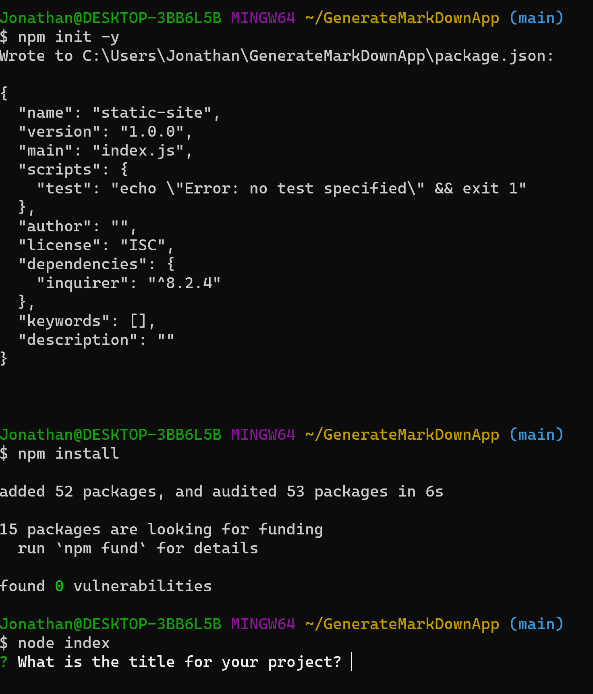
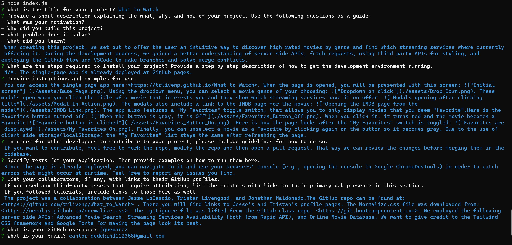
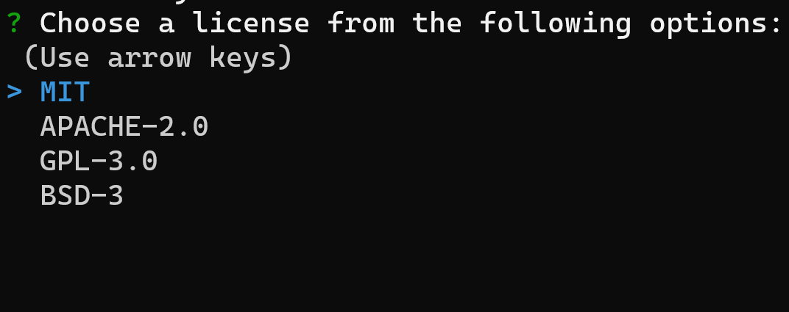
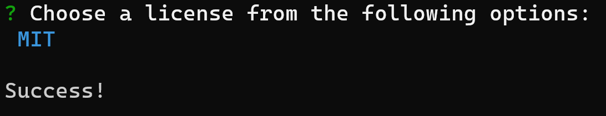
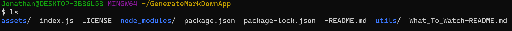

# Generate MarkDown App

## Description

As we know, documentation in general (and a good README file in particular) is crucial in letting other developers and potential users know what a project is about, how to install it and how to use it. With the purpose of aiding developers to be more expeditious in including documentation for their repos, we designed a simple CLI application that guides the developer through a series of prompts asking for all of the info necessary to produce a professional README.md file. Working through the challenge, provided the opportunity to learn more about the notion of modularity in Node.js, especially importing and exporting from different JS files and packages. Some of the modules where built-in in Node.js (File System (fs)), another one was installed through npm    (Inquirer v8.2.4), and another one was developed by me from starting code provided at the repo specified in the Credits section. It was necessary to learn how to use the basic functionality of the Screencastify Google extension in order to provide a demonstration of the app. The demonstration gives a walkthrough of the generation of another sample README.md file that can be found in this repo.

## Table of Contents

- [Installation](#installation)
- [Usage](#usage)
- [Credits](#credits)
- [License](#license)

## Installation

In order to install the application (assuming you have SSH keys for GitHub):

1. Open Git Bash and make a directory for the files on your local machine. Then clone the repo in the directory using the direction that appears in the following image:

2. Write the commands shown in the following screenshot of the CLI in order to initialize the new package, install the required dependency and start using the app:

As you are able to see, the first question is immediately prompted.

## Usage

1. Open up the terminal (Git Bash).

2. Once you navigate to the folder containing the index.js file, type the "node index.js" or "node index" commands.

3. The user will be guided through various questions. The following image shows all of the questions prompted in white text, while the answers are in blue:

4. The last prompt offers a list of four possible open-source licenses from which the user is supposed to choose just one:

5. When the user is done answering, a "Succes" message will be logged to the console if everything was find with the app. Otherwise, an error message will appear.

6. If successful, by navigating to the root folder where the "index.js" file lies, the user will be able to see the requested markdown file generated by the app (rightmost file displayed).

## Credits

The app is of the authorship of Jonathan Maldonado Guemarez and the repo can be found at: <https://www.github.com/jguemarez/GenerateMarkDownApp>.

The Google Drive link for the walktrhough video can be found at: <https://drive.google.com/file/d/1lZAZ9lRQSRMZQ_xmyRR82BYflYHyVG3y/view>.

It was developed from starting code found in : <https://www.github.com/coding-boot-camp/potential-enigma>.

The questions prompted by the application were for the most part extracted from the "Professional README Guide" from the "Full Stack Blog": <https://coding-boot-camp.github.io/full-stack/github/professional-readme-guide>

The .gitignore file was modified slightly from one provided at the Full Stack Bootcamp GitLab repo found at: <https://www.git.bootcampcontent.com/>

The images for the assets were taken from the What_to_Watch repo ("images" subfolder of the "assets" folder) found at: <https://www.github.com/trlivenp/What_to_Watch>

## How to Contribute

As an open-source project, everyone is welcome to do a fork of the repo for the application and "play" with a copy of the code in your local machine. In case there is an improvement or increase in functionality, you can add a pull request on my repo. I will then review the code before deciding whether to merge it in the codebase.

## Tests

Feel free to try and generate as much README files as you like in order to test the application. In case something goes wrong, an error message is set to appear in the console. You can take a screenshot of it and send it to the email adrees specified in the next section.

## Questions

The author's GitHub profile can be found at: <https://www.github.com/jguemarez>.
Any questions, complaints, and/or suggestions for improvements (like adding new optional sections to the README, making the CLI more intuitive or appealing, etc.) can be mailed to: <cantor.dedekind112358@gmail.com>

## License

This app is licensed under the terms of agreement put forth in the MIT license. For more information, please visit: <https://www.choosealicense.com/licenses/mit>.
