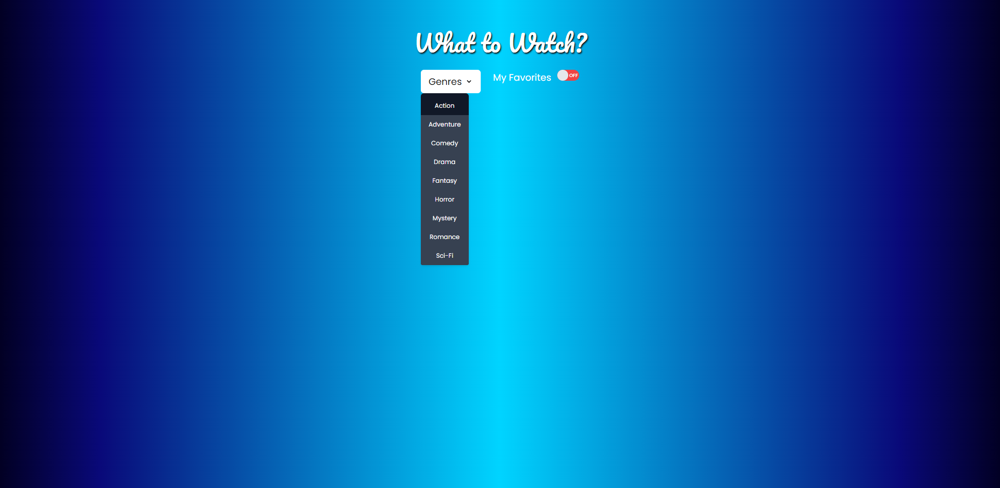
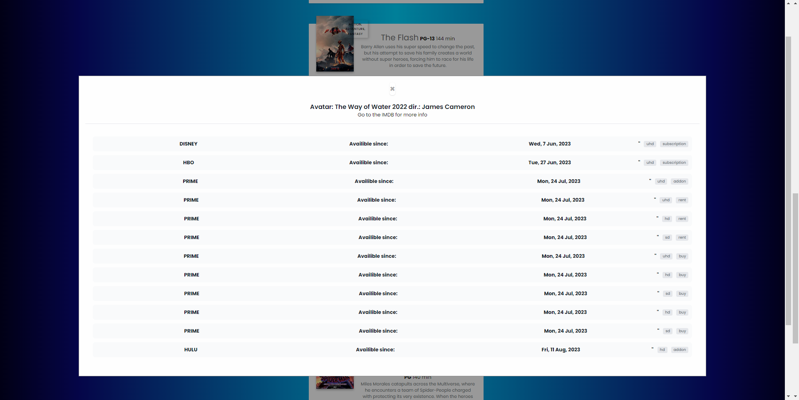
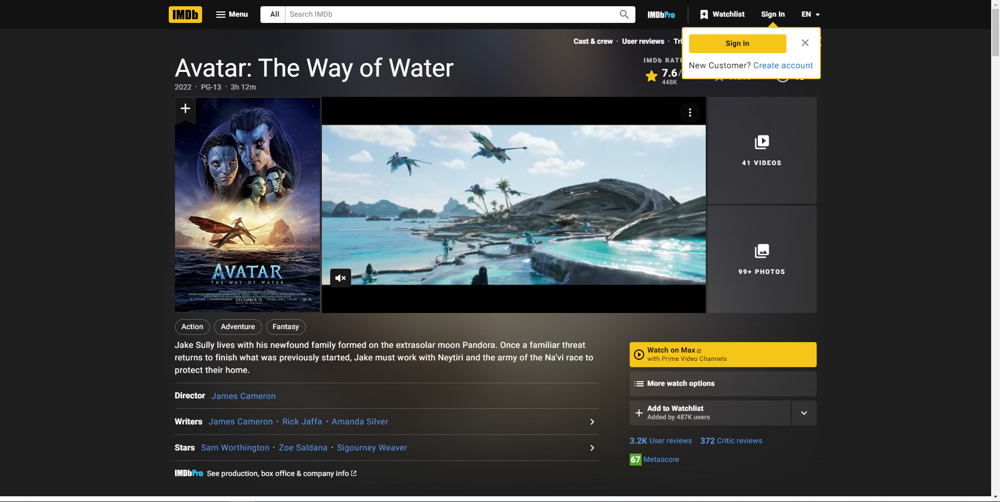
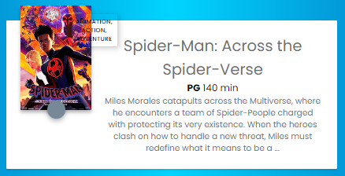
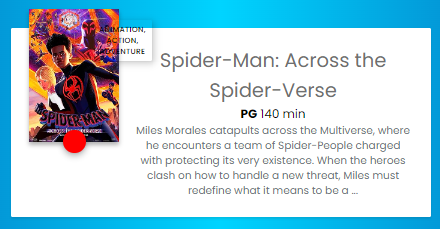
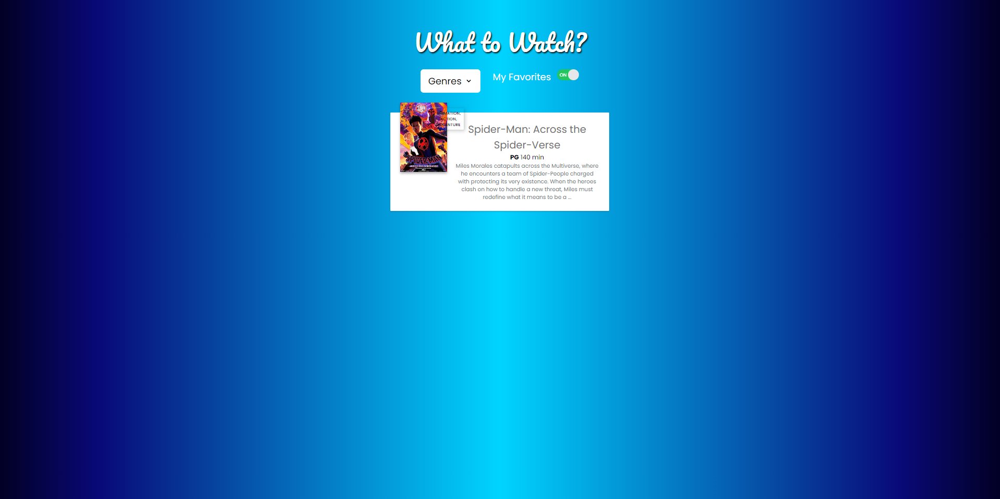

# What to Watch

## Description
  
When creating this project, we set out to offer the user an intuitive way to discover high rated movies by genre and find which streaming services where currently offering it. During the development process, we gained a better understanding of server side APIs, fetch requests, using third party APIs for styling, and employing the GitHub flow and VSCode to make branches and solve merge conflicts.

## Table of Contents

- [Installation](#installation)
- [Usage](#usage)
- [Credits](#credits)
- [License](#license)

## Installation

N/A: The single-page app is already deployed at GitHub pages.

## Usage

You can access the single-page app here:<https://trlivenp.github.io/What_to_Watch>. When the page is opened, you will be presented with this screen: !["Initial screen"] (./assets/Base_Page.png). Using the dropdown menu, you can select a movie genre of your choosing: . These modals open when you click the title of a movie that interests you and they show which streaming services have it on offer: . The modals also include a link to the IMDB page for the movie: . The app also features a "My Favorites" toggle switch, that allows you to only display movies that you deem "favorite". Here is the Favorites button turned off: . When you click it, it turns red and the movie becomes a Favorite: . Here is how the page looks after the "My Favorites" switch is toggled: . Finally, you can unselect a movie as a Favorite by clicking again on the button so it becomes gray. Due to the use of client-side storage(localStorage) the "My Favorites" list stays the same after refreshing the page.

## Credits

The project was a collaboration between Jesse LoCascio, Tristan Livengood, and Jonathan Maldonado.The GitHub repo can be found at: <https://github.com/trlivenp/What_to_Watch> . There you will find links to Jesse's and Tristan's profile pages. The Normalize.css file was downloaded from: <https://necolas.github.io/normalize.css>. The .gitignore file was lifted from the GitLab class repo: <https://git.bootcampcontent.com>. We employed the following server-side APIs: Advanced Movie Search, Streaming Services Availability (both from Rapid API), and Online Movie Database. We want to give credit to the Tailwind CSS framework and Google Fonts for making the page look its best.

## How to Contribute

If you want to contribute, feel free to fork the repo, modify the repo and then open a pull request. That way we can review the changes before merging them in the codebase.

## Tests

Since the page is already deployed, you can navigate to it and use your browsers' console (e.g., opening the console in Google ChromeDevTools) in order to catch errors that might occur at runtime. Feel free to report any issues you find.

## Questions

My GitHub username is "jguemarez" and you can checkout my profile at: <https://www.github.com/jguemarez>.
 For further questions and comments, you can mail them to the following address: <cantor.dedekind112358@gmail.com>.

## License

This is an open-source project under the terms of agreement provided by the MIT license. 
  For more information, click on the following link: <https://opensource.org/license/mit>

